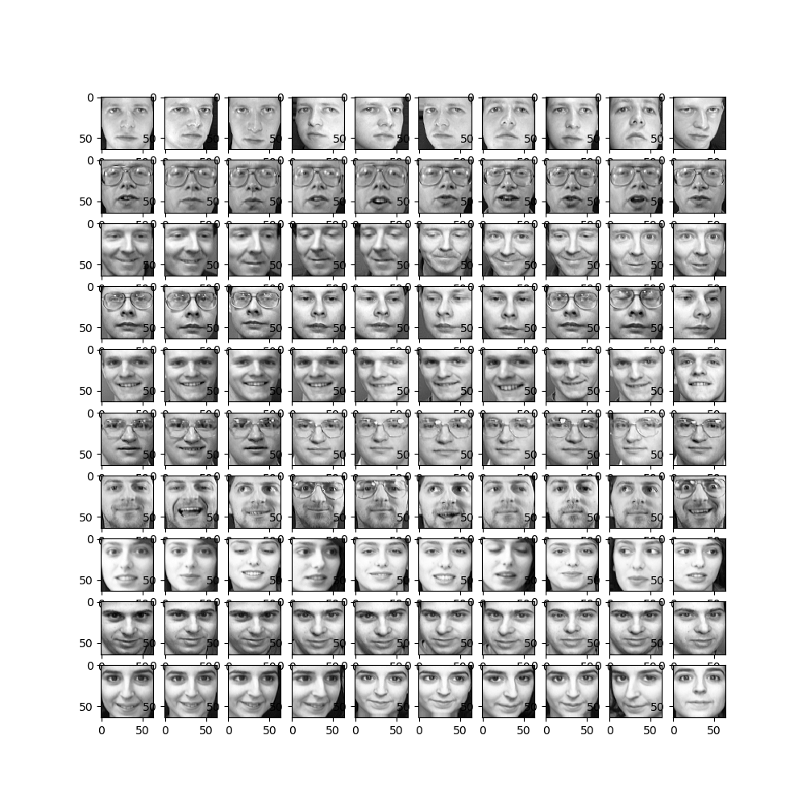
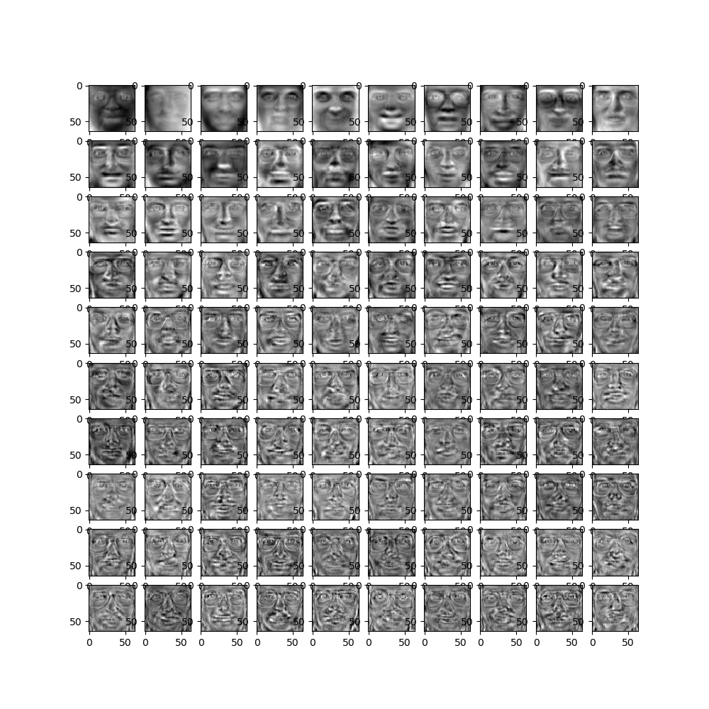
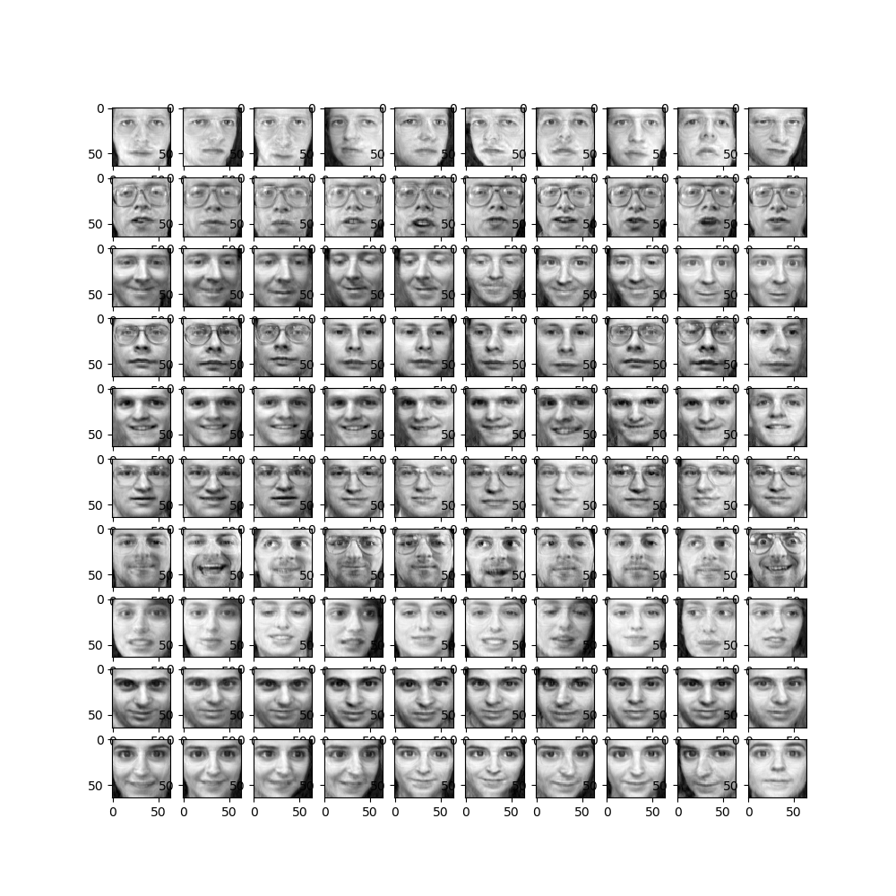

# Facial-Image-Compression

## Compression of a 400-image database using Principal Component Analysis(PCA)

Olivetti - Consists of the original 64x64 images   
DimRed - A custom implementation of PCA modified for this application  
Image Compression - Notebook file to demonstrate the compression  
compressed - Compressed version of the images  
new_images - Restored images after compression  

Original images:

Eigen Faces:

Reconstructed images:

